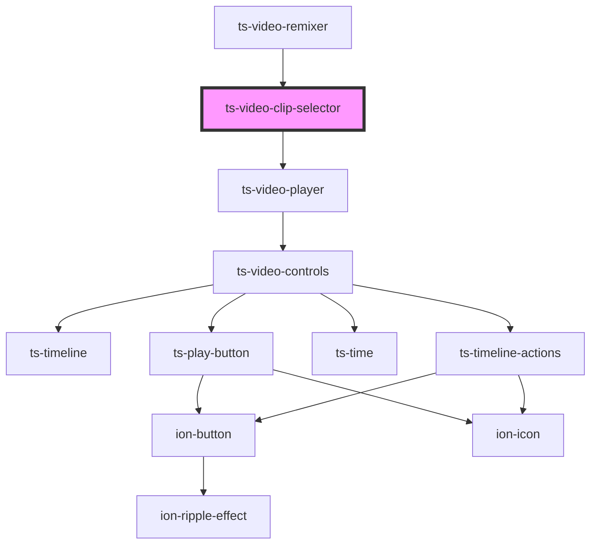

# ts-video-clip-selector

<!-- Auto Generated Below -->

## Properties

| Property | Attribute | Description | Type     | Default     |
| -------- | --------- | ----------- | -------- | ----------- |
| `video`  | `video`   |             | `string` | `undefined` |

## Events

| Event      | Description | Type                      |
| ---------- | ----------- | ------------------------- |
| `annotate` |             | `CustomEvent<Annotation>` |
| `edit`     |             | `CustomEvent<Annotation>` |

## Dependencies

### Used by

 - [ts-video-remixer](../video-remixer)

### Depends on

- [ts-video-player](../video-player)

### Graph

----------------------------------------------

*Built with [StencilJS](https://stenciljs.com/)*
