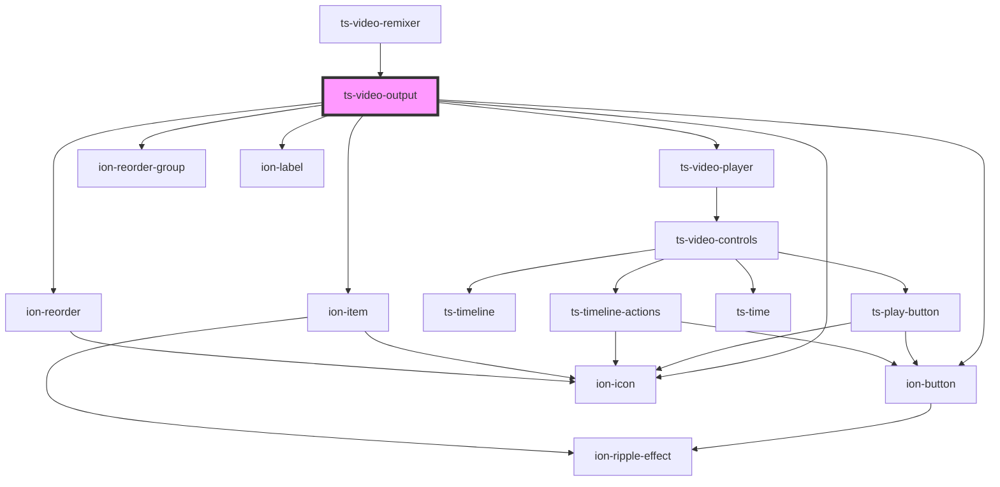

# ts-video-output

<!-- Auto Generated Below -->

## Properties

| Property       | Attribute       | Description | Type      | Default     |
| -------------- | --------------- | ----------- | --------- | ----------- |
| `clips`        | --              |             | `Clip[]`  | `[]`        |
| `remixedVideo` | `remixed-video` |             | `string`  | `undefined` |
| `remixing`     | `remixing`      |             | `boolean` | `undefined` |

## Events

| Event            | Description | Type                  |
| ---------------- | ----------- | --------------------- |
| `removedClip`    |             | `CustomEvent<Clip>`   |
| `reorderedClips` |             | `CustomEvent<Clip[]>` |
| `save`           |             | `CustomEvent<string>` |

## Dependencies

### Used by

 - [ts-video-remixer](../video-remixer)

### Depends on

- [ts-video-player](../video-player)
- ion-reorder-group
- ion-item
- ion-label
- ion-button
- ion-icon
- ion-reorder

### Graph

----------------------------------------------

*Built with [StencilJS](https://stenciljs.com/)*
