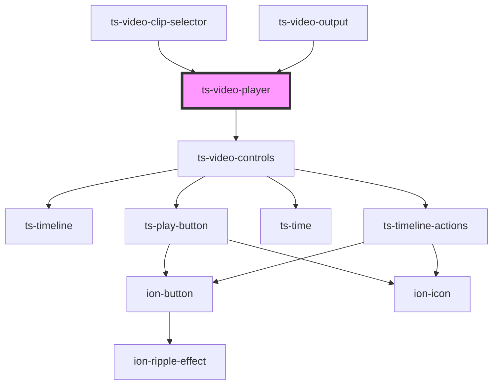

# ts-video-player

<!-- Auto Generated Below -->

## Properties

| Property            | Attribute            | Description | Type           | Default |
| ------------------- | -------------------- | ----------- | -------------- | ------- |
| `annotationEnabled` | `annotation-enabled` |             | `boolean`      | `false` |
| `annotations`       | --                   |             | `Annotation[]` | `null`  |
| `clips`             | --                   |             | `Clip[]`       | `[]`    |
| `editingEnabled`    | `editing-enabled`    |             | `boolean`      | `false` |

## Events

| Event      | Description | Type                      |
| ---------- | ----------- | ------------------------- |
| `annotate` |             | `CustomEvent<Annotation>` |
| `edit`     |             | `CustomEvent<Annotation>` |

## Methods

### `pause() => Promise<void>`

#### Returns

Type: `Promise<void>`

### `play() => Promise<void>`

#### Returns

Type: `Promise<void>`

### `setCurrentTime(currentTime: number) => Promise<void>`

#### Returns

Type: `Promise<void>`

### `stop() => Promise<void>`

#### Returns

Type: `Promise<void>`

## Dependencies

### Used by

 - [ts-video-clip-selector](../video-clip-selector)
 - [ts-video-output](../video-output)

### Depends on

- [ts-video-controls](../video-controls)

### Graph

----------------------------------------------

*Built with [StencilJS](https://stenciljs.com/)*
