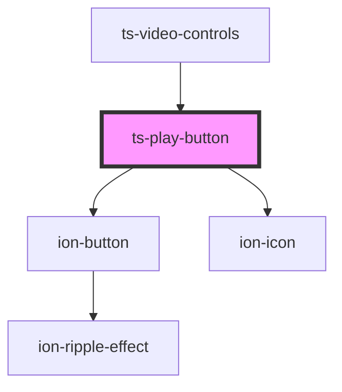

# ts-play-button

<!-- Auto Generated Below -->

## Properties

| Property                | Attribute                 | Description | Type      | Default     |
| ----------------------- | ------------------------- | ----------- | --------- | ----------- |
| `disabled`              | `disabled`                |             | `boolean` | `undefined` |
| `playing`               | `playing`                 |             | `boolean` | `undefined` |
| `scrubbingWhilePlaying` | `scrubbing-while-playing` |             | `boolean` | `undefined` |

## Events

| Event   | Description | Type               |
| ------- | ----------- | ------------------ |
| `pause` |             | `CustomEvent<any>` |
| `play`  |             | `CustomEvent<any>` |

## Dependencies

### Used by

 - [ts-video-controls](../video-controls)

### Depends on

- ion-button
- ion-icon

### Graph

----------------------------------------------

*Built with [StencilJS](https://stenciljs.com/)*
