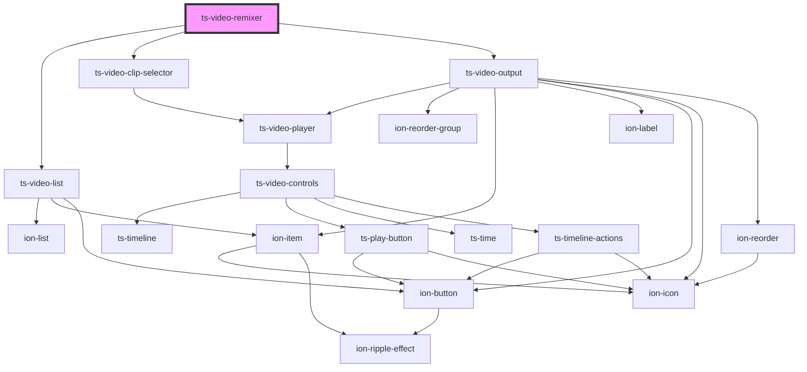

# my-component

<!-- Auto Generated Below -->

## Dependencies

### Depends on

- [ts-video-list](../video-list)
- [ts-video-clip-selector](../video-clip-selector)
- [ts-video-output](../video-output)

### Graph

----------------------------------------------

*Built with [StencilJS](https://stenciljs.com/)*
