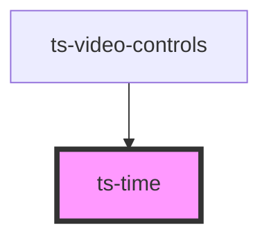

# ts-time

<!-- Auto Generated Below -->

## Properties

| Property      | Attribute      | Description | Type     | Default     |
| ------------- | -------------- | ----------- | -------- | ----------- |
| `currentTime` | `current-time` |             | `number` | `undefined` |
| `duration`    | `duration`     |             | `number` | `undefined` |

## Dependencies

### Used by

 - [ts-video-controls](../video-controls)

### Graph

----------------------------------------------

*Built with [StencilJS](https://stenciljs.com/)*
