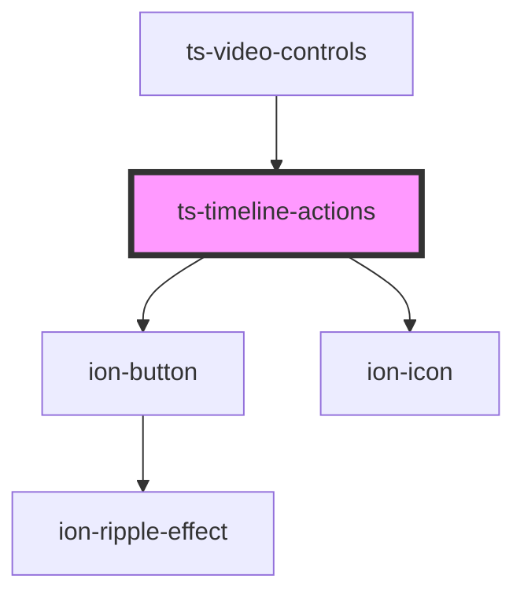

# ts-timeline-actions

<!-- Auto Generated Below -->

## Properties

| Property            | Attribute            | Description | Type         | Default     |
| ------------------- | -------------------- | ----------- | ------------ | ----------- |
| `annotation`        | --                   |             | `Annotation` | `undefined` |
| `annotationEnabled` | `annotation-enabled` |             | `boolean`    | `undefined` |
| `editingEnabled`    | `editing-enabled`    |             | `boolean`    | `undefined` |

## Events

| Event      | Description | Type                      |
| ---------- | ----------- | ------------------------- |
| `annotate` |             | `CustomEvent<Annotation>` |
| `edit`     |             | `CustomEvent<Annotation>` |

## Dependencies

### Used by

 - [ts-video-controls](../video-controls)

### Depends on

- ion-button
- ion-icon

### Graph

----------------------------------------------

*Built with [StencilJS](https://stenciljs.com/)*
