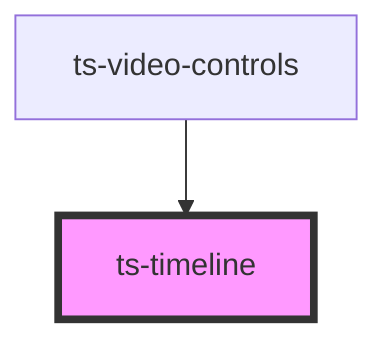

# ts-timeline

<!-- Auto Generated Below -->

## Properties

| Property            | Attribute            | Description | Type           | Default     |
| ------------------- | -------------------- | ----------- | -------------- | ----------- |
| `annotationEnabled` | `annotation-enabled` |             | `boolean`      | `undefined` |
| `annotations`       | --                   |             | `Annotation[]` | `[]`        |
| `currentTime`       | `current-time`       |             | `number`       | `0`         |
| `disabled`          | `disabled`           |             | `boolean`      | `undefined` |
| `duration`          | `duration`           |             | `number`       | `undefined` |

## Events

| Event              | Description | Type                                     |
| ------------------ | ----------- | ---------------------------------------- |
| `annotationChange` |             | `CustomEvent<Annotation>`                |
| `scrub`            |             | `CustomEvent<TimelineChangeEventDetail>` |
| `scrubEnd`         |             | `CustomEvent<TimelineChangeEventDetail>` |
| `scrubStart`       |             | `CustomEvent<TimelineChangeEventDetail>` |

## Dependencies

### Used by

 - [ts-video-controls](../video-controls)

### Graph

----------------------------------------------

*Built with [StencilJS](https://stenciljs.com/)*
