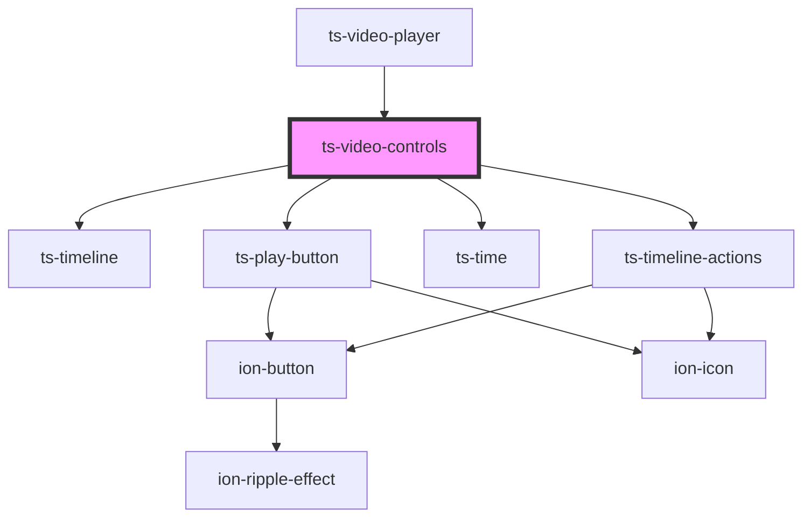

# ts-video-controls

<!-- Auto Generated Below -->

## Properties

| Property            | Attribute            | Description | Type           | Default     |
| ------------------- | -------------------- | ----------- | -------------- | ----------- |
| `annotationEnabled` | `annotation-enabled` |             | `boolean`      | `false`     |
| `annotations`       | --                   |             | `Annotation[]` | `undefined` |
| `currentTime`       | `current-time`       |             | `number`       | `0`         |
| `disabled`          | `disabled`           |             | `boolean`      | `false`     |
| `duration`          | `duration`           |             | `number`       | `0`         |
| `editingEnabled`    | `editing-enabled`    |             | `boolean`      | `false`     |
| `isPlaying`         | `is-playing`         |             | `boolean`      | `false`     |

## Events

| Event        | Description | Type                                     |
| ------------ | ----------- | ---------------------------------------- |
| `annotate`   |             | `CustomEvent<Annotation>`                |
| `edit`       |             | `CustomEvent<Annotation>`                |
| `pause`      |             | `CustomEvent<any>`                       |
| `play`       |             | `CustomEvent<any>`                       |
| `scrub`      |             | `CustomEvent<TimelineChangeEventDetail>` |
| `scrubEnd`   |             | `CustomEvent<TimelineChangeEventDetail>` |
| `scrubStart` |             | `CustomEvent<TimelineChangeEventDetail>` |

## Dependencies

### Used by

 - [ts-video-player](../video-player)

### Depends on

- [ts-timeline](../timeline)
- [ts-play-button](../play-button)
- [ts-time](../time)
- [ts-timeline-actions](../timeline-actions)

### Graph

----------------------------------------------

*Built with [StencilJS](https://stenciljs.com/)*
